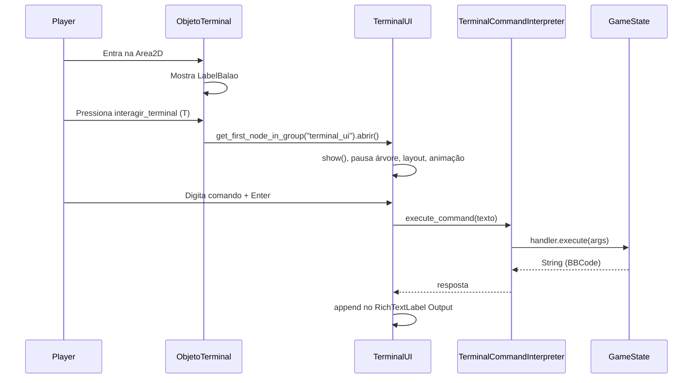

# Guia do desenvolvedor — Terminal e Inventário

Documentação para integrar, estender e depurar os sistemas de **hotbar (inventário)** e **terminal Git** no projeto **BranchSkipper** (Godot 4.6).

> **Escopo:** apenas as pastas `inventario/`, `terminal/`, `itens/` (coleta) e como elas entram nas fases. Não cobre movimentação do player, combate ou outros sistemas globais.

---

## Índice

1. [Visão geral](#1-visão-geral)
2. [Como usar numa fase nova](#2-como-usar-numa-fase-nova)
3. [Sistema de inventário (hotbar)](#3-sistema-de-inventário-hotbar)
4. [Sistema de itens coletáveis](#4-sistema-de-itens-coletáveis)
5. [Sistema de terminal](#5-sistema-de-terminal)
6. [Estado Git (`GameState`)](#6-estado-git-gamestate)
7. [Comandos Git disponíveis](#7-comandos-git-disponíveis)
8. [Entradas do jogador (Input Map)](#8-entradas-do-jogador-input-map)
9. [Referência rápida de API](#9-referência-rápida-de-api)
10. [Solução de problemas](#10-solução-de-problemas)

---

## 1. Visão geral

O jogo mistura exploração 2D com duas UIs em `CanvasLayer`:

| Sistema | Pasta principal | Função |
|--------|-----------------|--------|
| **Inventário** | `inventario/` | Hotbar fixa com 3 slots; seleção por teclas 1–3; itens do mapa vão para o primeiro slot vazio. |
| **Terminal** | `terminal/` | Janela modal ao interagir com um computador no mapa; comandos `git` simulados; pausa o jogo enquanto aberto. |

**Referência de fase:** `playground.tscn` instancia os dois sistemas assim:

- `InventarioUI` → `res://inventario/Inventario.tscn`
- `ObjetoTerminal` → `res://terminal/World/objeto_terminal.tscn`
- `TerminalUI` → `res://terminal/UI/terminal_ui.tscn` (inicia `visible = false`)

**Autoload global** (em `project.godot`):

- `GameState` → `res://terminal/Commands/game_state.gd` — estado do repositório Git da fase (working directory, stage, commits).

O inventário e o `GameState` **não estão ligados por código hoje**: coletar um item preenche a hotbar visualmente; o terminal usa listas de strings em `GameState.working_directory` (valores iniciais de exemplo). Para puzzles que exijam “item no chão → `git add`”, será preciso conectar os dois no futuro.

---

## 2. Como usar numa fase nova

### Checklist

1. Abra a cena da fase (ex.: duplicar `playground.tscn`).
2. **Instanciar inventário:** *Cena → Instanciar Cena Filha* → `inventario/Inventario.tscn`. O nó raiz deve se chamar **`InventarioUI`** (nome da cena) para a coleta funcionar.
3. **Instanciar terminal no mundo:** `terminal/World/objeto_terminal.tscn` — posicione onde o jogador deve interagir.
4. **Instanciar UI do terminal:** `terminal/UI/terminal_ui.tscn` — deixe como último filho da árvore (fica por cima). Pode marcar `visible = false` na cena da fase; o script também começa escondido.
5. Confirme que o player se chama **`Player`** (detecção por `body.name == "Player"`).
6. Verifique o **Input Map** (seção [8](#8-entradas-do-jogador-input-map)).

### Ordem sugerida na árvore

```
Fase (Node2D)
├── ... (mapa, inimigos, etc.)
├── Player
├── InventarioUI      ← CanvasLayer
├── Itens no mapa     ← instâncias de itens/item_teste.tscn
├── ObjetoTerminal    ← Area2D no mundo
└── TerminalUI        ← CanvasLayer (por último)
```

---

## 3. Sistema de inventário (hotbar)

### Estrutura de arquivos

```
inventario/
├── Inventario.tscn    # Cena da HUD
└── inventario.gd      # Lógica de slots e seleção
```

### Árvore de nós (`Inventario.tscn`)

```
InventarioUI (CanvasLayer)  ← script inventario.gd
└── HBoxContainer           ← ancorado na parte inferior central da tela
	├── Slot0 (Panel)
	│   ├── Icone (TextureRect)
	│   └── Highlight (ColorRect)   ← visível = slot selecionado
	├── Slot1 (Panel)
	│   ├── Icone
	│   └── Highlight
	└── Slot2 (Panel)
		├── Icone
		└── Highlight
```

- **3 slots**, índices **0, 1 e 2**.
- Slot vazio = `Icone.texture == null`.
- `Highlight` começa invisível em todos; apenas o slot ativo fica visível.

### Comportamento (`inventario.gd`)

| Momento | O que acontece |
|--------|----------------|
| `_ready()` | Chama `selecionar_slot(0)` — primeiro slot ativo. |
| Teclas `slot1` / `slot2` / `slot3` | Seleciona slot 0, 1 ou 2. |
| `selecionar_slot(indice)` | Desliga highlight de todos; liga só no índice escolhido. |
| `adicionar_item(nome, textura, cor)` | Procura o primeiro slot com `Icone.texture == null`, aplica textura/cor e retorna (sem valor de retorno explícito). |

**Importante:** a versão atual de `adicionar_item` **não retorna `bool`** e **não impede** coleta com inventário cheio — o item some do mapa mesmo se não houver slot (`item_teste.gd` sempre chama `queue_free()` após `adicionar_item`). Para inventário cheio, seria necessário alterar esse fluxo no futuro.

### API pública

```gdscript
# Seleciona o slot ativo (0..2)
func selecionar_slot(indice: int) -> void

# Coloca item no primeiro slot vazio
func adicionar_item(nome: String, textura: Texture2D, cor: Color) -> void
```

### Como obter o inventário de outro script

```gdscript
var inventario = get_tree().current_scene.find_child("InventarioUI")
if inventario:
	inventario.adicionar_item("MeuItem", minha_textura, Color.GREEN)
```

Ou, se o nó estiver no grupo (não configurado hoje), use `get_tree().get_first_node_in_group(...)`.

### Dicas visuais

- **Pixel art:** no nó `Icone` (TextureRect), use filtro **Nearest** para evitar blur.
- Tamanho dos ícones no slot é controlado por `expand_mode` / `stretch_mode` em `adicionar_item` (`EXPAND_IGNORE_SIZE`, `STRETCH_KEEP_ASPECT_CENTERED`).

Documentação legada adicional: `info-inventario.txt` na raiz do projeto (pode estar desatualizada em relação ao `.gd` atual).

---

## 4. Sistema de itens coletáveis

### Estrutura

```
itens/
├── item_teste.tscn
└── item_teste.gd
```

### Árvore

```
ItemTeste (Area2D)  ← script item_teste.gd
├── CollisionShape2D
└── Sprite2D
```

### Propriedades exportadas (Inspetor)

| Propriedade | Tipo | Uso |
|-------------|------|-----|
| `nome_do_item` | `String` | Nome lógico (ex.: `"Add"`, `"Commit"`). Apenas informativo na hotbar hoje. |
| `cor_do_item` | `Color` | Modulate do `Sprite2D` no chão e do ícone no inventário. |

### Fluxo de coleta

1. `body_entered` → se `body.name == "Player"` → `coletar()`.
2. `coletar()` busca `InventarioUI` na cena atual com `find_child("InventarioUI")`.
3. Chama `adicionar_item(nome_do_item, $Sprite2D.texture, cor_do_item)`.
4. `queue_free()` — remove o item do mapa.

### Criar um novo item no mapa

1. Instancie `itens/item_teste.tscn` na fase.
2. No Inspetor, ajuste `nome_do_item`, `cor_do_item` e escala do `Sprite2D`.
3. Troque a textura do `Sprite2D` se quiser outro ícone.
4. Garanta que **`InventarioUI`** exista na mesma cena.

Para itens com comportamento diferente, duplique a cena e o script em `itens/` mantendo o contrato `adicionar_item` + nome do nó `InventarioUI`.

---

## 5. Sistema de terminal

### Estrutura de arquivos

```
terminal/
├── UI/
│   ├── terminal_ui.tscn      # Interface modal (CanvasLayer)
│   └── terminal_ui.gd
├── World/
│   ├── objeto_terminal.tscn  # Interação no mapa (Area2D)
│   └── objeto_terminal.gd
├── Commands/
│   ├── game_state.gd         # Autoload GameState
│   ├── git_command.gd        # Classe base dos comandos
│   ├── git_init_command.gd
│   ├── git_add_command.gd
│   ├── git_commit_command.gd
│   └── git_status_command.gd
└── terminal_command_interpreter.gd
```

### Fluxo completo (jogador → tela)



### 5.1 Objeto no mundo (`objeto_terminal`)

- Tipo: `Area2D`.
- Detecta `Player` por **nome do nó** (`"Player"`).
- Mostra `LabelBalao`: *"Pressione T para acessar terminal"*.
- Com `interagir_terminal` pressionado e jogador na área:
  - Busca UI: `get_tree().get_first_node_in_group("terminal_ui")`.
  - Chama `abrir()` se existir.

**Requisito:** a cena `terminal_ui.tscn` deve estar na árvore e o script registra o grupo `"terminal_ui"` em `_ready()`.

### 5.2 Interface (`terminal_ui`)

- Tipo raiz: **`CanvasLayer`** (HUD independente da câmera 2D).
- `process_mode = PROCESS_MODE_ALWAYS` — funciona com o jogo pausado.
- Começa `hide()`; grupo `"terminal_ui"`.

#### Árvore de UI (resumida)

```
TerminalUI (CanvasLayer)
├── Overlay (ColorRect)              # escurece o fundo (~45% preto)
├── PainelCentralizador (Control)    # ocupa viewport (ajustado por script)
│   └── TerminalPanel (Panel)        # janela ~70% da tela (âncoras 15%–85%)
│       └── MarginContainer
│           └── VBoxContainer
│               ├── Header (HBoxContainer)
│               │   ├── TitleLabel
│               │   └── CloseButton
│               ├── Output (RichTextLabel)   # histórico — Fill + Expand
│               └── Input (LineEdit)         # entrada — Fill apenas
```

#### Layout responsivo

- O painel usa **âncoras proporcionais** (`0.15` a `0.85`) ≈ **70%** da largura e altura úteis, com margem para ver o jogo nas bordas.
- `_update_layout()` define tamanho de `PainelCentralizador` com `get_viewport().get_visible_rect()` (filhos de `CanvasLayer` nem sempre recebem retângulo do pai só com âncoras).
- `get_viewport().size_changed` reaplica layout enquanto o terminal está visível.
- `abrir()` faz `await get_tree().process_frame` antes do layout e da animação de abertura.

#### Abrir / fechar

| Método | Efeito |
|--------|--------|
| `abrir()` | Mostra UI, `get_tree().paused = true`, layout, tween de fade/scale, foco no `Input`. |
| `fechar()` | Esconde UI, `paused = false`. |

Fechar também por:

- Botão **X** (`CloseButton`).
- Comando `exit` no terminal.
- Ação `ui_cancel` (Esc) com terminal visível.

#### Escrever no histórico (de outro script)

```gdscript
var ui = get_tree().get_first_node_in_group("terminal_ui")
if ui:
	ui.escrever_no_terminal("Mensagem em texto puro ou [color=#3DFF9B]BBCode[/color]")
```

### 5.3 Interpretador de comandos

Arquivo: `terminal/terminal_command_interpreter.gd`  
`class_name TerminalCommandInterpreter`

- Instanciado como filho de `TerminalUI` em `_ready()`.
- Registra handlers via `preload` dos comandos em `Commands/`.
- **Paths nos preloads:** `res://Terminal/Commands/...` (T maiúsculo). No disco a pasta é `terminal/`; no Windows o Godot costuma resolver; em Linux, mantenha o mesmo casing dos paths do projeto.

#### Parsing

- Comandos devem começar com **`git`**.
- Tokenização com suporte a aspas: `git commit -m "minha mensagem"`.
- Retorno inválido: mensagem de erro em BBCode vermelha.

#### Handlers registrados

| Comando | Script |
|---------|--------|
| `init` | `git_init_command.gd` |
| `add` | `git_add_command.gd` |
| `commit` | `git_commit_command.gd` |
| `status` | `git_status_command.gd` |

---

## 6. Estado Git (`GameState`)

Autoload singleton — acesse de qualquer lugar:

```gdscript
GameState.git_inicializado
GameState.working_directory   # Array[String]
GameState.staging_area        # Array[String]
GameState.commits             # Array[Dictionary]
```

### Modelo simplificado (Fase 1)

| Conceito Git | Variável / método |
|--------------|-------------------|
| Repositório existe? | `git_inicializado` |
| Arquivos “no mundo” / não rastreados | `working_directory` |
| Staging (`git add`) | `staging_area` |
| Histórico | `commits` (dict com `id`, `mensagem`, `arquivos`) |

### Métodos principais

| Método | Descrição |
|--------|-----------|
| `inicializar_repositorio()` | `git init` |
| `adicionar_ao_stage(arquivo: String)` | `git add <arquivo>` |
| `criar_commit(mensagem: String)` | `git commit -m "..."` |
| `obter_status()` | Texto estilo `git status` (BBCode) |

### Estado inicial (`_ready` do autoload)

Por padrão, `working_directory` já contém:

- `"arquivo1.txt"`
- `"arquivo2.txt"`

Isso permite testar `git add` / `git status` sem ligar à hotbar. Para puzzles reais, alinhe nomes com itens coletados ou limpe/popule `working_directory` ao iniciar a fase.

---

## 7. Comandos Git disponíveis

Todos os exemplos assumem o terminal aberto e repositório no estado indicado.

| Comando digitado | Comportamento |
|------------------|---------------|
| `git init` | Inicializa repositório (`GameState.inicializar_repositorio()`). |
| `git status` | Lista staging e working directory. |
| `git add arquivo1.txt` | Move arquivo da working directory para staging (se existir e repo inicializado). |
| `git commit -m "mensagem"` | Cria commit com itens em staging; limpa stage; remove arquivos commitados da working directory. |
| `exit` | Fecha o terminal (tratado na UI, não no interpretador). |

### Mensagens de erro comuns

- Comando sem `git` → *"Comando inválido..."*
- Subcomando desconhecido → *"comando 'X' não disponível nesta fase"*
- `git add` sem repo → *fatal: not a git repository*
- `git add` arquivo inexistente → erro com nome do arquivo
- `git commit` sem staging → aviso para usar `git add`
- `git commit` sem `-m` ou mensagem → erro de uso

### Adicionar um novo comando Git (guia)

1. Crie `terminal/Commands/git_<nome>_command.gd` estendendo `git_command.gd`:

   ```gdscript
   extends "res://Terminal/Commands/git_command.gd"

   func execute(args: Array[String], _raw_input: String) -> String:
	   # lógica + retorno String (pode usar BBCode)
	   return "ok"
   ```

2. Registre em `terminal_command_interpreter.gd` dentro de `_handlers`.
3. Se precisar de estado persistente, use métodos em `GameState` ou estenda `game_state.gd`.

---

## 8. Entradas do jogador (Input Map)

Configuradas em `project.godot`:

| Ação | Tecla padrão | Usado por |
|------|--------------|-----------|
| `slot1` | `1` | Inventário — slot 0 |
| `slot2` | `2` | Inventário — slot 1 |
| `slot3` | `3` | Inventário — slot 2 |
| `interagir_terminal` | `T` | Abrir terminal no objeto |
| `ui_cancel` | Esc (ação Godot) | Fechar terminal |

Ao clonar o projeto, confira em **Projeto → Configurações do Projeto → Mapa de Entrada**.

---

## 9. Referência rápida de API

### Inventário (`inventario.gd`)

| Símbolo | Tipo | Descrição |
|---------|------|-----------|
| `slots` | `Array` (Panel) | Referências Slot0–2 |
| `selecionar_slot(indice)` | método | Highlight no slot |
| `adicionar_item(nome, textura, cor)` | método | Preenche primeiro slot vazio |

### Terminal UI (`terminal_ui.gd`)

| Símbolo | Tipo | Descrição |
|---------|------|-----------|
| Grupo | `"terminal_ui"` | Localizar a UI na árvore |
| `abrir()` | método | Abre modal e pausa |
| `fechar()` | método | Fecha e despausa |
| `escrever_no_terminal(mensagem)` | método | Append no `Output` |

### Objeto terminal (`objeto_terminal.gd`)

| Variável | Descrição |
|----------|-----------|
| `player_perto` | `true` quando Player está na área |
| `balao_aviso` | Label de dica |

### Interpretador

| Método | Retorno |
|--------|---------|
| `execute_command(raw_input: String)` | `String` (saída para o terminal) |

### GameState (autoload)

| Método | Retorno |
|--------|---------|
| `inicializar_repositorio()` | `String` |
| `adicionar_ao_stage(arquivo)` | `String` |
| `criar_commit(mensagem)` | `String` |
| `obter_status()` | `String` |

---

## 10. Solução de problemas

| Problema | Causa provável | O que verificar |
|----------|----------------|-----------------|
| Terminal não abre | UI ausente ou fora do grupo | `TerminalUI` na cena; grupo `terminal_ui` |
| Terminal não abre | Ação de input | `interagir_terminal` mapeada; jogador na área |
| Terminal não abre | Nome do player | Nó deve se chamar exatamente `Player` |
| Item não vai pro inventário | Nome do nó da HUD | Raiz deve ser `InventarioUI` para `find_child` |
| Item some mas slot vazio | Inventário cheio | `adicionar_item` não falha; comportamento atual |
| Comando git não encontrado | Path / preload | Paths `res://Terminal/...` vs pasta `terminal/` |
| `git add` não acha arquivo | Nome diferente do array | Conteúdo de `GameState.working_directory` |
| UI gigante / cortada | Viewport stretch | `display/window/stretch`; layout em `abrir()` e `size_changed` |
| Terminal atrás do mundo | Ordem na árvore | `TerminalUI` por último entre CanvasLayers |
| Jogo não pausa ao abrir | Outro `process_mode` | TerminalUI usa `PROCESS_MODE_ALWAYS` |

---

## Diagrama de dependências entre pastas

```
┌─────────────────┐     body_entered      ┌──────────────────┐
│  itens/         │ ──────────────────────►│  inventario/     │
│  item_teste     │   adicionar_item()     │  InventarioUI    │
└─────────────────┘                        └──────────────────┘

┌─────────────────┐     interagir_terminal   ┌──────────────────┐
│ terminal/World  │ ──────────────────────►│ terminal/UI      │
│ objeto_terminal │   abrir()              │ terminal_ui      │
└─────────────────┘                        └────────┬─────────┘
													  │
													  ▼
											┌──────────────────┐
											│ terminal/        │
											│ Commands +       │
											│ interpreter      │
											└────────┬─────────┘
													  │
													  ▼
											┌──────────────────┐
											│ GameState          │
											│ (autoload)         │
											└──────────────────┘
```

---

## Histórico deste documento

- Criado para onboarding de desenvolvedores nos sistemas **Inventário** e **Terminal**.
- Baseado no estado do repositório em maio/2026 (`playground.tscn` como exemplo de integração).

Para dúvidas sobre apenas a hotbar, consulte também `info-inventario.txt` na raiz (referência antiga; em caso de conflito, priorize este guia e os arquivos `.gd`).
